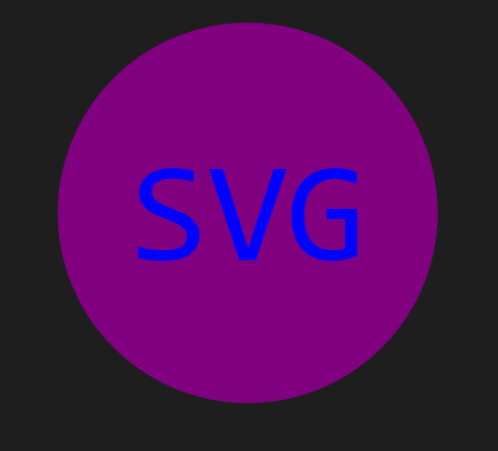
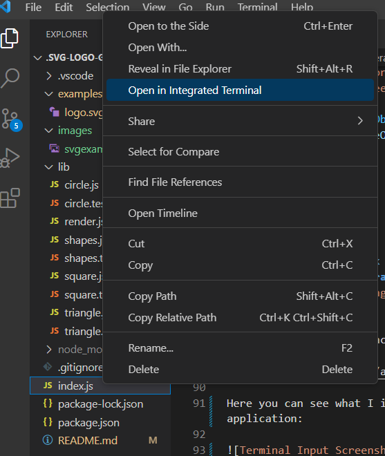
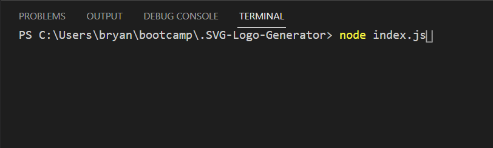
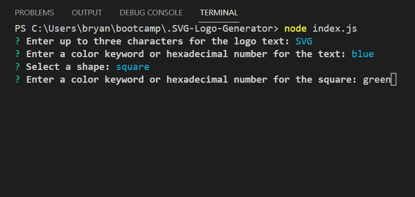
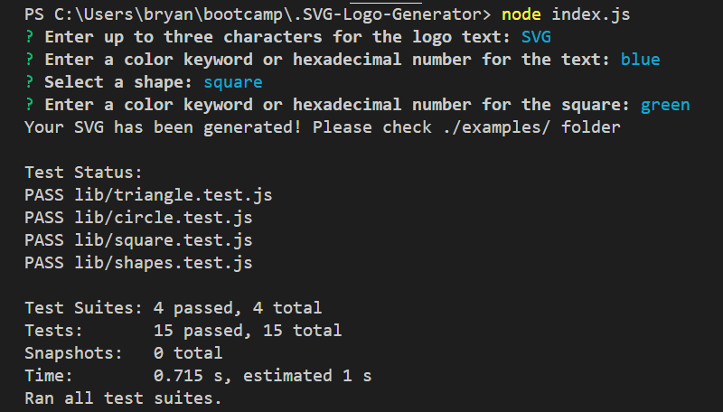
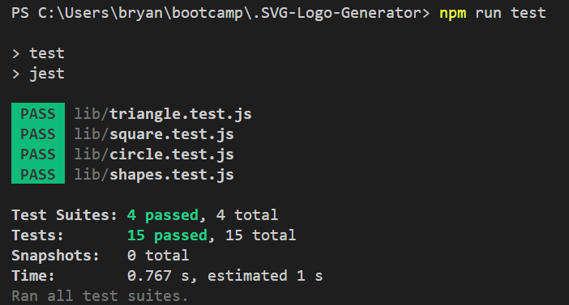
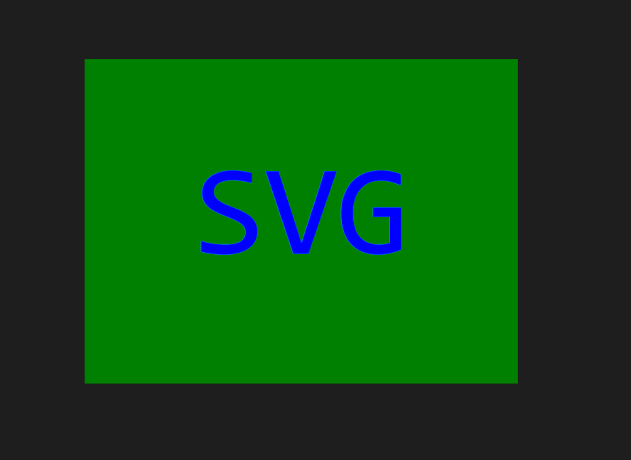

# .SVG-Logo-Generator

## Description 

This is a SVG Logo Generator, this is a tool to automate a users life and make creating your logo both efficient and creative. Users will get prompted with questions using node.js that will allow users to choose different color and shape options. This generator uses the inquirer package in order to prompt users with questions that will then be stored and generated in a dynamic function that generates the SVG logo in a separate 'examples' folder.

## Mock-Up

The following image shows an example of a generated SVG logo through this application:



### Here is a video link to show what a user might encounter when using the SVG Logo Generator properly:
[Example Application Usage](https://watch.screencastify.com/v/Cm0qja6cWXNEyOkbHjFJ)

## Table of Contents

* [Installation](#installation)
* [Code Example](#code-example)
* [Usage](#usage)
* [Learning Points](#learning-points)
* [Author Info](#author-info)
* [Credits](#credits)
* [License](#license)

## Installation

1. Clone down the repository or download all files within repository
2. You will need to install node.js
3. Open terminal within VS Code and type 'node index.js'
4. Enter your inputs as you wish
5. Find your generated SVG logo under the examples folder, and download it or upload it to your project as you wish.


## Code Example

Here is an example of my functions within my shapes.js and my shapes.test.js that allow the program to test the user inputs if they are valid in the scope and constraints that the program has set, and if they are the test will pass and the logo will be generated. This shape.js is the parent class that is being extended into by all the individual shape classes (circle, triangle, and square).

shape.js:
```javascript
class Shape { 
    constructor(text, textColor, shapeColor){
        this.text = text;
        this.textColor = textColor;
        this.shapeColor = shapeColor;
    }
}

module.exports = Shape;
```

shapes.test.js:
```javascript
const Shape = require('./shapes.js');

describe('shapeCheck', () => {
    const text = 'svg';
    const textColor = 'blue';
    const shapeColor = 'green';

    describe('Text Test', () => {
        it(`Checks to see if text is equal to "${text}"`, () => {
            const shapeObj = new Shape(text);
            expect(shapeObj.text).toEqual(text);
        });
    });

    describe('Text Color Test', () => {
        it(`Checks to see if color is equal to "${textColor}"`, () => {
            const shapeObj = new Shape(text, textColor);
            expect(shapeObj.textColor).toEqual(textColor);
        });
    });

    describe('Shape Color Test', () => {
        it(`Checks to see if shape color is equal to "${shapeColor}"`, () => {
            const shapeObj = new Shape(text, textColor, shapeColor);
            expect(shapeObj.shapeColor).toEqual(shapeColor);
        });
    });
});
```

## Usage

### Here is a video link to show what a user might encounter when using the SVG Logo Generator properly:
[Example Application Usage](https://watch.screencastify.com/v/Cm0qja6cWXNEyOkbHjFJ)

Here you can see how I access the terminal within VS Code:



Here you can see what I input into the terminal to initalize the application:



Here you can see the list of prompts the user can then input by typing or selecting if it is a list:



Here you can see after finishing the prompts the users inputs are console logged then a message stating whether or not the generated SVG was generated and saved happened:



Here you can see me typing 'npm run test' to actually get the actual tests to initialize instead of before I had console logged them:



Here is the generated SVG with the user inputs:




## Learning Points 

This was a really fun task in my opinion. I believe automation and making daily monotonous tasks easier and more efficient is something I truly believe in. This project taught me a lot and solidified my knowledge of node.js as well as using the inquirer package. It also taught me how to integrate testing using the jest package within javascript. I believe that after this project I now am knowledgeable within testing suites, and their potential application usage towards the world of full-stack web development. There was not very many stopping points for me but definitely more to improve on in the future. I want more user prompted critieria so if users want to they are able to be more specific as to what they want within their logo and make different graphical settings they can choose from (opacity, gradients, different fonts, etc).

## About Me

Hi, my name is Bryan Nguyen I am an up and coming full-stack web developer working
on getting into the space with projects that support both my growth, belief, and imagination. I hope to one day work within the realm of AI, web-development, and even site-reliability/cyber-security.

## My links

* [Portfolio](https://bryannguyen9.github.io/Bryan-Nguyen-Portfolio/)
* [LinkedIn](https://linkedin.com/in/bryannguyen9)
* [Github](https://github.com/bryannguyen9)


## Credits

### Special thanks to David Chung: 
 
 * His Github Portfolio: [David-Chung-Github](https://github.com/dchung13/)
 * His Linked-In: [David-Chung-LinkedIn](https://www.linkedin.com/in/david-chung-77141526b/)
 * His Portfolio Site: [David-Chung-Portfolio](https://dchung13.github.io/David-Chung-Portfolio/) 

### Special thanks to these reference websites that taught me different functionalities within my website for me to create a seamless experience for users.

1. [Developer Mozilla](https://developer.mozilla.org/en-US/docs/Web/SVG/Tutorial/Getting_Started)
2. [Stack Overflow](https://stackoverflow.com/questions/12209582/the-describe-keyword-in-javascript)
3. [jest](https://nodejs.org/docs/latest-v18.x/api/)

## License

MIT License

Copyright (c) [2023] [Bryan-Nguyen]

Permission is hereby granted, free of charge, to any person obtaining a copy
of this software and associated documentation files (the "Software"), to deal
in the Software without restriction, including without limitation the rights
to use, copy, modify, merge, publish, distribute, sublicense, and/or sell
copies of the Software, and to permit persons to whom the Software is
furnished to do so, subject to the following conditions:

The above copyright notice and this permission notice shall be included in all
copies or substantial portions of the Software.

THE SOFTWARE IS PROVIDED "AS IS", WITHOUT WARRANTY OF ANY KIND, EXPRESS OR
IMPLIED, INCLUDING BUT NOT LIMITED TO THE WARRANTIES OF MERCHANTABILITY,
FITNESS FOR A PARTICULAR PURPOSE AND NONINFRINGEMENT. IN NO EVENT SHALL THE
AUTHORS OR COPYRIGHT HOLDERS BE LIABLE FOR ANY CLAIM, DAMAGES OR OTHER
LIABILITY, WHETHER IN AN ACTION OF CONTRACT, TORT OR OTHERWISE, ARISING FROM,
OUT OF OR IN CONNECTION WITH THE SOFTWARE OR THE USE OR OTHER DEALINGS IN THE
SOFTWARE.

